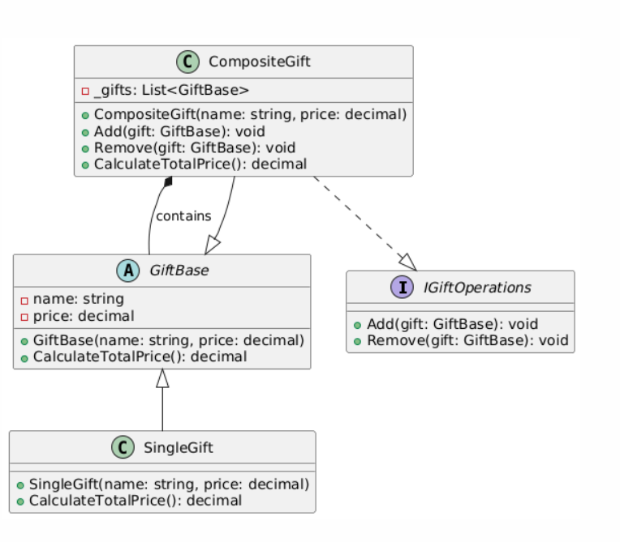

# CompositeDesignPattern

This project demonstrates the Composite Design Pattern, which is a structural design pattern that allows you to compose objects into tree-like structures to represent part-whole hierarchies. The Composite pattern enables you to treat individual objects and compositions of objects uniformly.

In this project, the Composite pattern is illustrated through a system of gifts. The system consists of single gifts and composite gifts, where a composite gift can contain other gifts (both single and composite). This hierarchical structure allows for flexible management of groups of gifts as if they were single items.

**Real-World Applications**: The Composite Design Pattern is applicable in various scenarios such as:

- **File Systems** : Representing files and directories where both files and directories are treated uniformly.
- **Organization Structures** : Modeling hierarchies in organizations where employees and departments can be managed as a whole.
- **GUI Components** : Managing complex UI components where individual components and containers are treated similarly.

# Design

The Composite Design Pattern consists of the following parts:
1. **Component** :
- The ' GiftBase ' class serves as the component in the Composite pattern. It defines common operations for both individual gifts and gift collections. This class provides a unified interface for handling all types of gifts.
2. **Leaf** :
- The ' SingleGift ' class represents a leaf in the Composite pattern. It is a concrete implementation of the ' GiftBase ' class and represents an individual gift without any sub-elements. The SingleGift class handles operations specific to individual gifts.
3. **Composite** :
- The ' CompositeGift ' class acts as a composite, managing collections of ' GiftBase ' objects, including other ' CompositeGift ' instances. It treats both individual gifts and composites uniformly, handling hierarchies through the ' GiftBase ' interface without depending on specific child types.

 Here ,
 - 'A' represents abstract class
 - 'C' represents concrete class
 - 'I' represents Interface class

# Environment
The project builds and runs with Visual Studio Community 2022 when the required workloads are installed.
